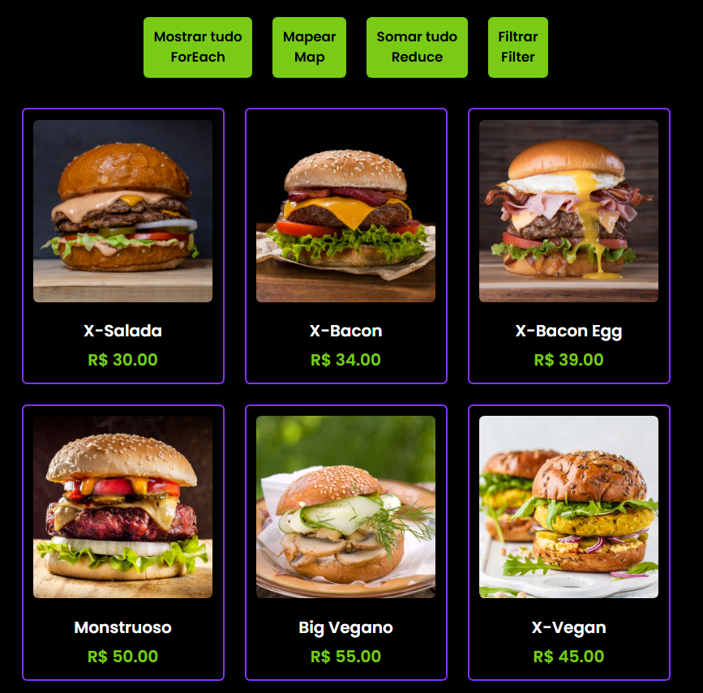

# 🍔 Dev Burguer

Projeto desenvolvido com HTML, CSS e JavaScript para praticar manipulação de arrays e programação funcional utilizando os métodos map, filter e reduce.

## 🚀 Tecnologias Utilizadas

- HTML5
- CSS3
- JavaScript

## 📚 Conceitos Praticados

- Manipulação de arrays
- Funções de callback
- map()
- filter()
- reduce()
- Eventos
- Manipulação do DOM

## 🎯 Funcionalidades

- Aplicar desconto aos produtos
- Filtrar itens do cardápio
- Exibir apenas categorias específicas
- Calcular o valor total dos produtos
- Atualizar a interface dinamicamente

## 📷 Demonstração

## 💡 Objetivo

Este projeto foi desenvolvido para consolidar conhecimentos em JavaScript, especialmente no uso dos métodos map, filter e reduce, amplamente utilizados no desenvolvimento front-end moderno.

## 👨‍💻 Autor

Felipe Ramos Leite da Silva
